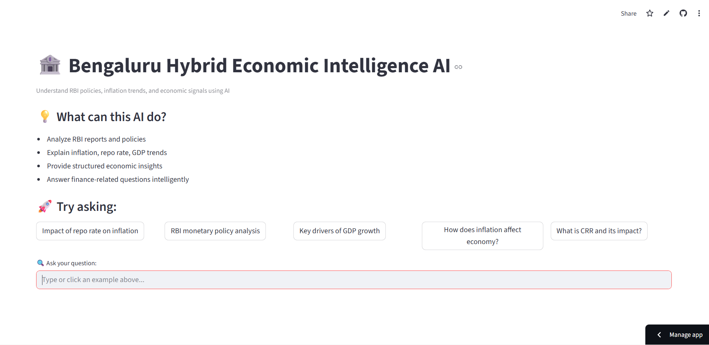

# 🏦 Bengaluru Hybrid Economic Intelligence AI

An advanced **AI-powered economic intelligence system** that leverages **Retrieval-Augmented Generation (RAG)** to analyze RBI data and generate **structured, data-driven insights** on inflation, GDP, and monetary policy.

---

## 🚀 Live Demo

👉 https://economic-forecaster-ai-by-me-for-you-sangu0121.streamlit.app

---

## 💡 Problem Statement

Understanding macroeconomic indicators like inflation, GDP, and RBI policy decisions requires analyzing large volumes of financial reports and documents.

Traditional approaches are:

* Time-consuming
* Not interactive
* Require domain expertise

---

## 🎯 Solution

This project builds an **intelligent AI system** that:

* Retrieves relevant economic data from RBI documents
* Applies semantic understanding using embeddings
* Generates structured insights using LLMs

---

## 🧠 System Architecture

```text
User Query
   ↓
Semantic Retrieval (Chroma DB)
   ↓
Document Re-ranking
   ↓
Context Construction
   ↓
LLM (Groq - LLaMA 3.1)
   ↓
Structured Insights + Citations
```

---

## ⚙️ Core Features

### 🔍 1. Retrieval-Augmented Generation (RAG)

* Uses vector embeddings for semantic search
* Ensures context-aware responses
* Reduces hallucinations

---

### ⚖️ 2. Document Re-ranking Engine

* Prioritizes most relevant chunks
* Improves answer quality
* Enhances precision

---

### 🧠 3. Multi-stage Reasoning Pipeline

* Query → Retrieval → Ranking → Generation
* Mimics real-world AI system design

---

### 📊 4. Structured AI Output

Each response includes:

* **Key Insights**
* **Analysis**
* **Implications**
* **Evidence**
* **Confidence Score**

---

### 📚 5. Source-backed Responses

* Displays document sources
* Improves transparency and trust

---

### ⚡ 6. Performance Optimization

* Persistent vector database
* Reduced latency
* Efficient retrieval

---

## 🛠️ Tech Stack

| Component   | Technology           |
| ----------- | -------------------- |
| Frontend    | Streamlit            |
| LLM         | Groq (LLaMA 3.1)     |
| Embeddings  | SentenceTransformers |
| Vector DB   | Chroma               |
| Data Source | RBI Documents        |

---

## 📊 Example Queries

* Impact of repo rate on inflation
* GDP growth drivers in India
* RBI monetary policy analysis

---

## 📂 Project Structure

```text
main.py              # Core application
requirements.txt     # Dependencies
rbi_data/            # Sample RBI documents
```

---

## ⚡ Installation

```bash
git clone https://github.com/your-username/economic-intelligence-ai.git
cd economic-intelligence-ai
pip install -r requirements.txt
streamlit run main.py
```

---

## 📈 Key Highlights

* Designed using **system-level thinking** (not just API usage)
* Implements **real-world RAG pipeline architecture**
* Focuses on **domain-specific AI (economics)**
* Built with **performance and usability in mind**

---

## ⚠️ Limitations

* Uses static RBI datasets (no real-time data)
* Performance depends on document quality
* Limited to economic domain

---

## 🚀 Future Enhancements

* Integration with **real-time economic APIs**
* Advanced **multi-hop reasoning**
* Trend analysis and forecasting
* Deployment with scalable backend

---



## 👨‍💻 Author

**H Sangamesh**
AI & Data Science Enthusiast

---

## ⭐ Support

If you found this project useful, consider giving it a ⭐
